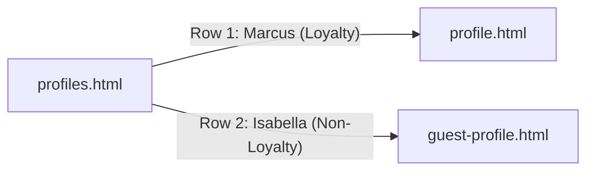

# Guest Profiles Listing Page

## Overview

Create a searchable, filterable guest listing table with two distinct profile types accessible from it.

## File Structure

| File | Purpose |

|------|---------|

| `profiles.html` | NEW - Listing page with table and filters |

| `profile.html` | KEEP - Loyalty member profile (current) |

| `guest-profile.html` | NEW - Non-loyalty guest profile (Isabella Chen scenario) |

## profiles.html Structure

### Header

- Title: "Guest Profiles"
- Search bar
- Filter pills/dropdowns

### Filters

- **Loyalty Status**: All / Members / Non-Members
- **Lifecycle**: All / New / Active / At-Risk / Lapsed
- **Segment**: Dropdown

### Table Columns

| Column | Description |

|--------|-------------|

| Guest | Avatar + Name |

| Email | Primary email |

| Phone | Phone number |

| Loyalty Status | "Gold Member" / "Non-Member" etc. |

| LTV | Lifetime value |

| Orders | Total order count |

| Source | Web App, POS, Punchh |

| Last Activity | Date |

### Sample Rows

1. **Marcus Thompson** → Links to `profile.html` (loyalty profile)
2. **Isabella Chen** → Links to `guest-profile.html` (non-loyalty, stitched profile)

## guest-profile.html Content

Based on previous conversation: Isabella Chen as a non-loyalty guest who made purchases via Web App and in-store POS, with credit card stitching. Timeline shows profile creation, orders, emails/SMS sent.

## Files to Modify

- **Create**: `profiles.html` - New listing page
- **Create**: `guest-profile.html` - Non-loyalty profile (based on Isabella scenario)
- **Keep**: `profile.html` - Rename user to "Marcus Thompson" for consistency
- **Update**: All sidebar links to point "Profiles" → `profiles.html`
- **Update**: `styles.css` - Add listing table and filter styles